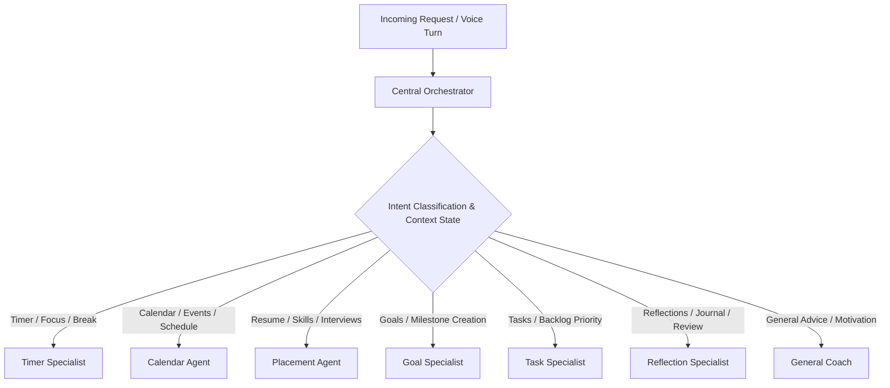
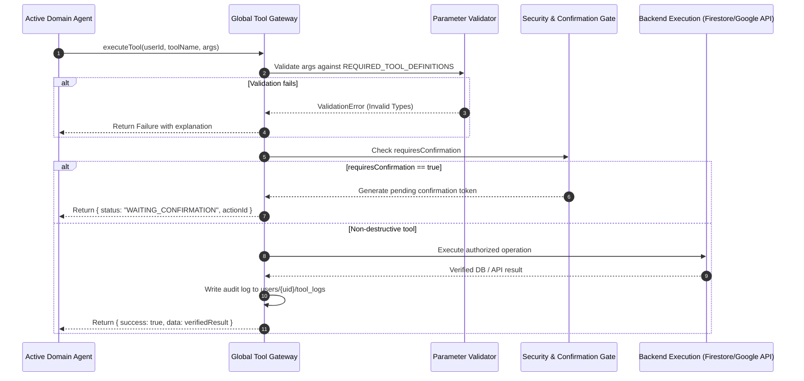
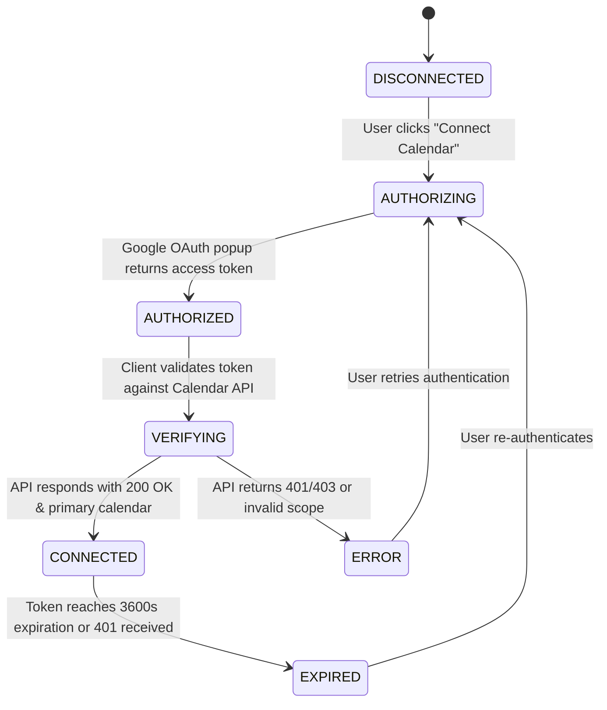

# LifeForge AI — Technical Architecture & Engineering Specification

This document details the software architecture, data pipelines, agent interactions, and security models governing LifeForge AI.

---

## 1. System Overview

LifeForge AI is an integrated, voice-first autonomous agent platform. It provides real-time multimodal dialogue, continuous academic and career coaching, and automated productivity management. The platform operates on a single unified runtime combining Next.js 15 App Router HTTP endpoints with an active WebSocket server managed by [server.ts](file:///d:/hack2skill/apac_cohort_3/LifeForge-AI/server.ts).

```mermaid
graph TB
    subgraph Browser ["Web Browser Client"]
        ClientCore[Next.js App Shell & React 19 Engine]
        AudioIn[Microphone Capture: 16 kHz PCM]
        AudioOut[Web Audio API Playback: 24 kHz PCM]
        StateStore[Local & Authoritative State Listeners]
    end

    subgraph ServerRuntime ["Node.js Runtime (server.ts)"]
        WSServer[WebSocket Live Voice Stream Handler]
        NextApp[Next.js App Router HTTP Engine]
        GatewayCore[Deterministic Tool Gateway]
        CentralOrch[Central Orchestrator]
    end

    subgraph AIPlatform ["Google Gemini API Services"]
        GeminiLive["Gemini 3.1 Flash Live (Audio S2S)"]
        GeminiReasoning["Gemini 3.8 Flash (Reasoning & Tools)"]
        GeminiEmbedding["Gemini Embedding 2 Preview (Vectors)"]
    end

    subgraph PersistentStorage ["Google Cloud & Firebase Services"]
        FStore[(Firebase Firestore - users/{uid}/*)]
        FStorage[(Firebase Cloud Storage - Resumes)]
        GoogleCal[Google Calendar API]
    end

    AudioIn -->|Binary WebSocket PCM Frames| WSServer
    WSServer <-->|Live Voice Session Stream| GeminiLive
    GeminiLive -->|Specialist Handoff| CentralOrch
    CentralOrch --> GeminiReasoning
    ClientCore -->|SSE / REST API Calls| NextApp
    NextApp --> CentralOrch
    CentralOrch --> GatewayCore
    GatewayCore -->|Authenticated Queries| FStore
    GatewayCore -->|Document Uploads| FStorage
    GatewayCore -->|OAuth Calendar Mutations| GoogleCal
    GatewayCore -->|Verified Typed Result| CentralOrch
    CentralOrch -->|Spoken Response Payload| WSServer
    WSServer -->|24 kHz Binary Audio| AudioOut
```

---

## 2. Frontend Architecture (React 19 & Next.js 15)

The frontend uses Next.js 15 App Router with client-side reactive views housed under [components/views/](file:///d:/hack2skill/apac_cohort_3/LifeForge-AI/components/views):

- **[AppShell.tsx](file:///d:/hack2skill/apac_cohort_3/LifeForge-AI/components/layout/AppShell.tsx)**: Top-level navigational frame rendering the sidebar, live status banner, active focus timer badge, and confirmation modals.
- **[LiveCoachView.tsx](file:///d:/hack2skill/apac_cohort_3/LifeForge-AI/components/views/LiveCoachView.tsx)**: Houses the interactive 3D/animated voice orb, audio level visualizer, real-time message stream, and Live System sidebar (calendar connection widget and resume upload button).
- **[DashboardView.tsx](file:///d:/hack2skill/apac_cohort_3/LifeForge-AI/components/views/DashboardView.tsx)**: Renders quick-glance metrics, focus duration graphs, motivation quote cards, and today's schedule.
- **[GoalsTasksView.tsx](file:///d:/hack2skill/apac_cohort_3/LifeForge-AI/components/views/GoalsTasksView.tsx)**: Milestone breakdown with progress sliders, task priority tagging, and deep work indicators.
- **[PlacementsView.tsx](file:///d:/hack2skill/apac_cohort_3/LifeForge-AI/components/views/PlacementsView.tsx)**: Resume analysis view with ATS rating, technical skill pills, experience cards, and dynamic mock interview question generator.
- **[CalendarView.tsx](file:///d:/hack2skill/apac_cohort_3/LifeForge-AI/components/views/CalendarView.tsx)**: Direct Google Calendar agenda view with real-time event creation and synchronization status.
- **[ReflectionsView.tsx](file:///d:/hack2skill/apac_cohort_3/LifeForge-AI/components/views/ReflectionsView.tsx)**: Habit tracker, daily reflection log, discipline score visualizer, and weekly trend graphs.
- **[PrivacyView.tsx](file:///d:/hack2skill/apac_cohort_3/LifeForge-AI/components/views/PrivacyView.tsx)**: Granular user data export, operational log viewer, and domain-specific / full-account data erasure.

---

## 3. Real-Time Audio Pipeline & WebSocket Protocol

### 3.1 Audio Ingestion & Capture
1. Client initializes an `AudioContext` at 16,000 Hz via [hooks/useLiveVoice.ts](file:///d:/hack2skill/apac_cohort_3/LifeForge-AI/hooks/useLiveVoice.ts).
2. A custom `ScriptProcessorNode` or `AudioWorklet` intercepts incoming raw microphone audio buffers.
3. Samples are converted to 16-bit signed Linear PCM format (little-endian).
4. Audio chunks are serialized into binary WebSocket frames and transmitted to the custom server every 40–100 milliseconds.

### 3.2 Bidirectional Streaming via Gemini 3.1 Flash Live
1. [server.ts](file:///d:/hack2skill/apac_cohort_3/LifeForge-AI/server.ts) receives binary WebSocket frames and immediately pipes them to the active `@google/genai` Live session running `gemini-3.1-flash-live-preview`.
2. Gemini returns server audio chunks at 24,000 Hz PCM alongside real-time transcript deltas.
3. Server relays 24 kHz chunks to the client over the WebSocket.
4. Client schedules buffers into an `AudioBufferSourceNode` queue for low-latency playback.

### 3.3 Barge-In & Interrupt Management
- If the user speaks while the model is responding:
  - The client detects speech volume above the ambient noise threshold.
  - An `{ type: "interrupt" }` JSON control message is dispatched over the WebSocket.
  - The server terminates the ongoing Gemini generation turn.
  - The client stops all queued `AudioBufferSourceNodes` and resets audio buffer pointers, ensuring an instantaneous, natural cutoff.

---

## 4. Multi-Agent Orchestration & Routing Architecture

Routing is governed by the [CentralOrchestrator](file:///d:/hack2skill/apac_cohort_3/LifeForge-AI/lib/orchestrator/orchestrator.ts) singleton.



### Agent Roster Details

1. **Central Orchestrator (`CentralOrchestrator`)**:
   - Model: `gemini-3.8-flash`
   - Purpose: Top-level router assessing user queries, active modal states, and context history.
2. **General Coach (`GeneralCoach`)**:
   - Model: `gemini-3.8-flash`
   - Purpose: Multi-turn conversational coaching, active recall study suggestions, and emotional grounding.
3. **Timer Specialist (`Study Agent`)**:
   - Model: `gemini-3.8-flash` / `gemini-3.1-flash-live-preview`
   - Purpose: Manages the 25/5 Pomodoro interval lifecycle, drift verification, and audio notifications.
4. **Calendar Agent (`Calendar Agent`)**:
   - Model: `gemini-3.8-flash`
   - Purpose: Interacts with Google Calendar API, detects scheduling conflicts, and creates events.
5. **Placement Agent (`Placement Agent`)**:
   - Model: `gemini-3.8-flash`
   - Purpose: Performs resume extraction, ATS analysis, and project-based technical defense interviews.
6. **Goal Specialist (`Goal Specialist`)**:
   - Model: `gemini-3.8-flash`
   - Purpose: Manages long-term milestone decomposition and progress calculations.
7. **Task Specialist (`Task Specialist`)**:
   - Model: `gemini-3.8-flash`
   - Purpose: Manages granular task items, priority tagging, and deep work allocations.
8. **Reflection Specialist (`Reflection Specialist`)**:
   - Model: `gemini-3.8-flash`
   - Purpose: Synthesizes daily productivity metrics and habit adherence scores.

---

## 5. Authoritative Tool Gateway & Execution Lifecycle

All tool invocations route through [lib/tools/gateway.ts](file:///d:/hack2skill/apac_cohort_3/LifeForge-AI/lib/tools/gateway.ts). The Gateway guarantees that tools return **verified backend results**, never ungrounded model hallucinations.



### Complete Tool Roster (27 Tools)

#### Goals & Tasks (9 Tools)
1. `create_goal`: Adds milestone goal to Firestore `users/{uid}/goals`.
2. `update_goal`: Updates progress percentage and status.
3. `get_goal`: Retrieves student goals.
4. `delete_goal`: Destructive deletion; requires human confirmation token.
5. `create_task`: Adds task with priority and deep work metadata.
6. `edit_task`: Edits title, description, or status.
7. `update_task`: Updates completion status.
8. `get_task`: Fetches active tasks.
9. `delete_task`: Destructive deletion; requires human confirmation token.

#### Study & Focus Timer (7 Tools)
10. `start_focus_timer`: Starts canonical 25-minute Pomodoro timer.
11. `pause_focus_timer`: Freezes running timer countdown.
12. `resume_focus_timer`: Resumes countdown from remaining seconds.
13. `restart_focus_timer`: Resets timer to full duration.
14. `stop_focus_timer`: Cancels and stops timer.
15. `start_break_timer`: Starts a 5-minute break timer.
16. `get_focus_timer`: Returns current remaining seconds and run status.
17. `save_study_session`: Logs study block to `users/{uid}/study_sessions`.

#### Placement & Resume (10 Tools)
18. `upload_resume`: Returns resume upload prompt link.
19. `analyze_resume`: Extracts skills, projects, and strengths using Gemini 3.8 Flash.
20. `get_resume_summary`: Returns structured skills and projects.
21. `get_resume_analysis`: Returns detailed ATS rating and skill gaps.
22. `get_resume_questions`: Retrieves project-specific defense questions.
23. `analyze_skill_gap`: Compares profile against industry engineering roles.
24. `research_company`: Grounded search on company tech stack and interview patterns.
25. `generate_interview_questions`: Generates customized technical drills.
26. `generate_resume_interview_questions`: Technical drills grounded in user's resume.
27. `get_resume_status`: Returns current parsed state (`EMPTY`, `PARSING`, `READY`, `ERROR`).
28. `request_resume_upload`: Prompts user to supply an updated resume.

#### Google Calendar (6 Tools)
29. `get_calendar_connection_status`: Checks 7-state OAuth connection status.
30. `connect_calendar`: Directs user to OAuth authorization flow.
31. `get_calendar_events`: Retrieves upcoming schedule events.
32. `create_calendar_event`: Schedules focus/study blocks on Google Calendar.
33. `update_calendar_event`: Reschedules or edits existing calendar entries.
34. `delete_calendar_event`: Removes event from user calendar.

#### Reflection & Conversation (7 Tools)
35. `generate_daily_reflection`: Synthesizes day's tasks, study sessions, and transcripts.
36. `generate_reflection`: Generates periodic reflection summary.
37. `generate_weekly_reflection`: Identifies longitudinal patterns and habit discipline.
38. `create_reflection`: Persists reflection document to `users/{uid}/reflections`.
39. `get_reflection`: Fetches past reflection history.
40. `get_conversation`: Retrieves conversation metadata.
41. `get_recent_messages`: Loads chronological turn history.
42. `search_conversation`: Keyword search across past conversations.
43. `summarize_conversation`: Asynchronously generates rolling summary.
44. `end_live_session`: Closes WebSocket, releases microphone, and saves session.

---

## 6. Firebase Data Model & User Isolation

All persistent user data is scoped under `users/{userId}/*`.

```
firestore-root
└── users
    └── {userId} [Owner only: request.auth.uid == userId]
        ├── profile: { email, displayName, createdAt, settings }
        ├── goals
        │   └── {goalId}: { title, targetDate, progress, status, createdAt, updatedAt }
        ├── tasks
        │   └── {taskId}: { title, priority, completed, dueDate, isDeepWork, goalId }
        ├── conversations
        │   └── {convId}: { title, startedAt, updatedAt, mode }
        │       └── messages
        │           └── {msgId}: { role, content, toolCalls, timestamp }
        ├── reflections
        │   └── {reflectionId}: { date, whatWorked, whatFailed, disciplineScore, focusScore }
        ├── placement_profile
        │   └── default: { skills, experience, education, projects, strengths, gaps }
        ├── resume_metadata
        │   └── current: { fileName, storagePath, parsedAt, status, fileSize }
        ├── calendar_events
        │   └── {eventId}: { title, startDateTime, endDateTime, calendarId }
        ├── study_sessions
        │   └── {sessionId}: { subject, durationMinutes, timestamp, notes }
        ├── tool_logs
        │   └── {logId}: { toolName, agent, durationMs, status, timestamp }
        └── action_confirmations
            └── {actionId}: { action, targetId, status, createdAt, expiresAt }
```

### Security Rules ([firestore.rules](file:///d:/hack2skill/apac_cohort_3/LifeForge-AI/firestore.rules))
```javascript
rules_version = '2';
service cloud.firestore {
  match /databases/{database}/documents {
    match /{document=**} {
      allow read, write: if false;
    }
    function isAuthenticated() {
      return request.auth != null && request.auth.uid != null;
    }
    function isOwner(userId) {
      return isAuthenticated() && request.auth.uid == userId;
    }
    match /users/{userId} {
      allow read, write: if isOwner(userId);
      match /{subcollection=**} {
        allow read, write: if isOwner(userId);
      }
    }
  }
}
```

---

## 7. Canonical Resume Pipeline & Anti-Hallucination Barrier

1. **Binary Ingestion**: Resumes uploaded through [PlacementsView.tsx](file:///d:/hack2skill/apac_cohort_3/LifeForge-AI/components/views/PlacementsView.tsx) are posted to `/api/placement/resume`.
2. **Cloud Storage**: File saved to `users/{userId}/placement/resumes/{resumeId}`.
3. **Structured Extraction**: Extracted text is processed by `gemini-3.8-flash` with strict JSON schema enforcing extraction of:
   - `skills` (technical and soft skills)
   - `experience` (roles, companies, dates, accomplishments)
   - `projects` (name, technologies, metrics)
   - `strengths` & `gaps`
   - `interviewQuestions` (technical defense questions)
4. **Normalized Persistence**: Saved to `users/{userId}/placement_profile/default`.
5. **Anti-Hallucination Barrier**: `getCanonicalResume()` and `get_resume_summary` strictly report `READY` only when verified skills exist in Firestore, ensuring the Placement Agent never hallucinates missing data.

---

## 8. Google Calendar 7-State Connection Machine

The calendar subsystem ([lib/calendar.ts](file:///d:/hack2skill/apac_cohort_3/LifeForge-AI/lib/calendar.ts)) operates as a deterministic finite-state automaton:



---

## 9. Persistent Focus Timer Architecture

The canonical timer is managed by the [TimerManager](file:///d:/hack2skill/apac_cohort_3/LifeForge-AI/lib/timer.ts) singleton:

- **Target End-Time Calculation**: When started, the timer computes `targetEndTime = Date.now() + (durationMinutes * 60 * 1000)`.
- **Drift Correction**: Instead of decrementing an integer every second, the timer recalculates `remainingSeconds = Math.max(0, Math.round((targetEndTime - Date.now()) / 1000))` on each tick.
- **Route Navigation Resilience**: The `targetEndTime` and running state are persisted in `localStorage` and shared across views via React context. Switching between Dashboard, Goals, Placements, or Calendar does not disrupt the countdown.
- **Audio Notification**: When `remainingSeconds === 0`, an HTML5 audio tone plays, and a study session entry is logged to Firestore.

---

## 10. Hybrid Retrieval & Context Architecture

The retrieval engine ([lib/retrieval/hybridEngine.ts](file:///d:/hack2skill/apac_cohort_3/LifeForge-AI/lib/retrieval/hybridEngine.ts)) synthesizes private user history to ground agent responses:

1. **Record Adaptation**: Goals, tasks, past reflections, and study sessions are normalized into generic `RetrievalRecord` items.
2. **Dense Vector Embeddings**: Documents are embedded via `gemini-embedding-2-preview` (768 dimensions) into in-memory/cache cosine distance indices.
3. **Keyword Matching**: Query tokens are matched against titles and descriptions for exact-term retrieval.
4. **Hybrid Scoring**: Combines dense cosine similarity (70% weight) with keyword BM25/term density (30% weight).
5. **Context Compaction**: The top $K$ records (default $K=6$) are formatted into a markdown block injected into Gemini 3.8 Flash's prompt, preceded by prompt injection sanitization barriers.

---

## 11. Testing & Quality Assurance Architecture

LifeForge AI implements a layered testing strategy across unit, integration, and browser end-to-end automation:

- **Unit & Stability Tests**: [tests/live-voice-stability.test.ts](file:///d:/hack2skill/apac_cohort_3/LifeForge-AI/tests/live-voice-stability.test.ts) validates WebSocket message framing, audio chunk encoding, and reconnect behavior.
- **Playwright E2E Suites**:
  - `auth.setup.ts`: Google Auth session generation and storage state caching.
  - `resume-live-coach.spec.ts`: End-to-end resume upload, analysis, and Placement Agent interview simulation.
  - `timer.spec.ts` & `timer-parity-integrity.spec.ts`: Global timer persistence across tab navigation and audio triggers.
  - `calendar.spec.ts`: Google Calendar connection state transitions and schedule retrieval.
  - `privacy-deletion.spec.ts`: Confirmation token gating and batch data purging.
  - `comprehensive-e2e-rigorous.spec.ts`: Multi-agent orchestration across voice and text modes.

---

## 12. Engineering Lifecycle (SDLC)

```
Requirements & Intent Modeling
       │
       ▼
Architecture & Schema Design (JSON schemas, Firestore rules)
       │
       ▼
Implementation (Next.js 15, React 19, TypeScript 5.9, TailwindCSS 4)
       │
       ▼
Automated Unit & Stability Testing (tsx tests/live-voice-stability.test.ts)
       │
       ▼
End-to-End Browser Automation (npx playwright test)
       │
       ▼
Security & Rule Verification (npm run firebase:verify)
       │
       ▼
Production Build Validation (npm run build)
       │
       ▼
Manual Voice & Usability QA (http://localhost:3000)
       │
       ▼
Release Deployment
```
