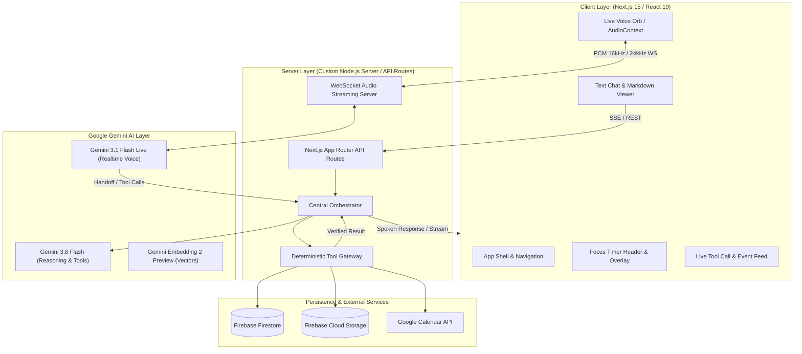
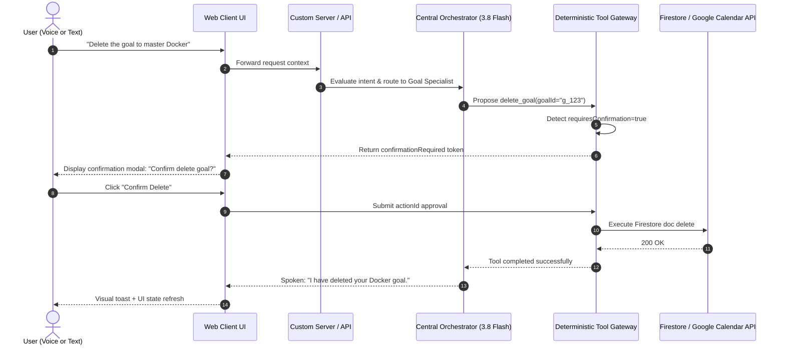

# LifeForge AI — Autonomous Agentic Coaching & Placement Platform

> **LifeForge AI** is an enterprise-grade, multimodal productivity, study orchestration, and placement acceleration system. Built on **Next.js 15**, **React 19**, and **Google Gemini**, LifeForge pairs real-time bidirectional audio streaming via **Gemini 3.1 Flash Live** with deep autonomous reasoning and structured extraction via **Gemini 3.8 Flash**.

---

## 1. Project Purpose & Problem Statement

Modern students and knowledge workers face fragmented workflows across separate apps: task managers, Pomodoro clocks, calendar schedulers, resume builders, and study coaches. This fragmentation causes context switching, lost momentum, and lack of accountability.

**LifeForge AI solves this by acting as an integrated, voice-first autonomous life coach.** It combines:
- Real-time spoken dialogue with ultra-low latency barge-in.
- Autonomous domain specialists routed through a Central Orchestrator.
- Deterministic tool calling against personal cloud data (Firestore, Cloud Storage, Google Calendar).
- Cryptographic confirmation barriers for destructive operations.
- Privacy-first, user-scoped data isolation (`users/{userId}/*`).

---

## 2. Key Capabilities

- **Live Voice Coaching**: Low-latency bidirectional conversational streaming via WebSockets with instant barge-in and audio interrupt handling.
- **Multimodal Text Conversation**: High-reasoning chat with full turn history, live tool invocation feeds, and rolling summaries.
- **Dynamic Agent Handoff**: Central Orchestrator evaluates user intent and hands off tasks to 8 specialized domain agents.
- **Deterministic Tool Calling**: Authoritative Tool Gateway executing 27 typed tools with parameter validation and execution logs.
- **Persistent Focus Timer**: Pomodoro clock with drift correction that survives browser navigation, tab changes, and reloads.
- **Placement Intelligence & Resume Analysis**: PDF/DOCX resume extraction via Gemini 3.8 Flash, skill gap mapping, and technical interview drills.
- **Google Calendar Synchronization**: 7-state bidirectional OAuth integration supporting live schedule queries and event scheduling.
- **Daily & Weekly Reflections**: Automated synthesis of study habits, completed tasks, and focus score trends.
- **Human-in-the-Loop Safeguards**: Cryptographically tracked confirmation tokens required before executing destructive deletions (`delete_goal`, `delete_task`).
- **Comprehensive Data Isolation**: Granular Firestore security rules enforcing strict user ownership (`request.auth.uid == userId`).

---

## 3. High-Level Architecture Overview



---

## 4. Gemini AI Model Roster

| Model Identifier | Primary File Location | Responsibilities | Input Modality | Output Modality | Execution Nature |
| :--- | :--- | :--- | :--- | :--- | :--- |
| `gemini-3.1-flash-live-preview` | [server.ts](file:///d:/hack2skill/apac_cohort_3/LifeForge-AI/server.ts) | Live bidirectional streaming voice, barge-in detection, real-time speech-to-speech dialogue | 16 kHz PCM Audio | 24 kHz PCM Audio + JSON | Realtime Streaming |
| `gemini-3.8-flash` | [app/api/coach/route.ts](file:///d:/hack2skill/apac_cohort_3/LifeForge-AI/app/api/coach/route.ts), [app/api/placement/resume/route.ts](file:///d:/hack2skill/apac_cohort_3/LifeForge-AI/app/api/placement/resume/route.ts) | Deep reasoning, multi-agent dispatch, structured resume extraction, reflection synthesis | Text, JSON, PDF/DOCX Binary | Clean Text, Validated JSON | Synchronous / SSE Stream |
| `gemini-embedding-2-preview` | [lib/retrieval/embeddings.ts](file:///d:/hack2skill/apac_cohort_3/LifeForge-AI/lib/retrieval/embeddings.ts) | Dense vector generation for hybrid semantic retrieval over memories and reflections | Text Strings | 768-dim Vector Float Array | Synchronous |

---

## 5. Active Agent Roster (8 Active Agents)

The [CentralOrchestrator](file:///d:/hack2skill/apac_cohort_3/LifeForge-AI/lib/orchestrator/orchestrator.ts) dynamically evaluates user intent, session context, and authoritative application state to route execution:

| Agent Name | Specialist Domain | Primary Responsibility | Backing Model | Primary Tools Accessible |
| :--- | :--- | :--- | :--- | :--- |
| **Central Orchestrator** | `orchestrator` | Top-level intent classification, multi-agent handoff, contextual coordination | `gemini-3.8-flash` | All 27 tools (delegated) |
| **General Coach** | `GeneralCoach` | General conversational guidance, study advice, motivational affirmations | `gemini-3.8-flash` | `get_conversation`, `summarize_conversation` |
| **Timer Specialist** | `Timer` / `study` | Pomodoro session initiation, pause/resume, drift-free interval calculations | `gemini-3.8-flash` / Live | `start_focus_timer`, `pause_focus_timer`, `resume_focus_timer`, `stop_focus_timer`, `get_focus_timer` |
| **Calendar Agent** | `Calendar` | Google Calendar OAuth verification, conflict detection, event scheduling | `gemini-3.8-flash` | `get_calendar_connection_status`, `get_calendar_events`, `create_calendar_event`, `update_calendar_event`, `delete_calendar_event` |
| **Placement Agent** | `Placement` | Resume parsing, skill gap analysis, technical interview simulation | `gemini-3.8-flash` | `upload_resume`, `analyze_resume`, `get_resume_summary`, `get_resume_analysis`, `generate_interview_questions` |
| **Goal Specialist** | `GoalTask` / `goals` | Semester milestone tracking, progress computation, target date planning | `gemini-3.8-flash` | `create_goal`, `update_goal`, `get_goal`, `delete_goal` |
| **Task Specialist** | `GoalTask` / `tasks` | Actionable checklist item creation, deep work allocation, priority triage | `gemini-3.8-flash` | `create_task`, `edit_task`, `update_task`, `get_task`, `delete_task` |
| **Reflection Specialist**| `Reflection` | Daily/weekly habit synthesis, mood scoring, discipline review | `gemini-3.8-flash` | `generate_daily_reflection`, `generate_weekly_reflection`, `create_reflection`, `get_reflection` |

---

## 6. Authoritative Tool Inventory (27 Tools)

All tools are registered in [lib/tools/registry.ts](file:///d:/hack2skill/apac_cohort_3/LifeForge-AI/lib/tools/registry.ts) and executed through the [globalToolGateway](file:///d:/hack2skill/apac_cohort_3/LifeForge-AI/lib/tools/gateway.ts):

### Goals & Tasks
- `create_goal`: Adds milestone goal to Firestore `users/{uid}/goals`.
- `update_goal`: Updates progress percentage and status.
- `get_goal`: Retrieves student goals.
- `delete_goal`: **Destructive action**. Generates token requiring explicit human confirmation.
- `create_task`: Adds task item with priority, estimated minutes, and deep work flags.
- `edit_task`: Edits task title, status, or description.
- `update_task`: Toggles task completion state.
- `get_task`: Fetches pending or completed tasks.
- `delete_task`: **Destructive action**. Generates token requiring explicit human confirmation.

### Study & Timer
- `start_focus_timer`: Initiates canonical 25-minute Pomodoro focus interval.
- `pause_focus_timer`: Pauses active countdown in central TimerManager.
- `resume_focus_timer`: Resumes countdown from remaining seconds.
- `restart_focus_timer`: Resets running timer to starting duration.
- `stop_focus_timer`: Stops timer and clears active countdown.
- `start_break_timer`: Initiates a 5-minute break timer.
- `get_focus_timer`: Returns current remaining seconds and run status.
- `save_study_session`: Logs completed study block to Firestore `users/{uid}/study_sessions`.

### Placement & Resume
- `upload_resume`: Prompts user with direct upload action link.
- `analyze_resume`: Extracts skills, projects, and strengths using Gemini 3.8 Flash.
- `get_resume_summary`: Returns verified structured skills and projects.
- `get_resume_analysis`: Returns detailed ATS score, gaps, and recommendations.
- `get_resume_questions`: Retrieves project-specific defense questions.
- `analyze_skill_gap`: Compares profile against target industry roles.
- `research_company`: Grounded search on company tech stack and interview patterns.
- `generate_interview_questions`: Generates customized technical drills.
- `generate_resume_interview_questions`: Deep-dives into resume project claims.
- `get_resume_status`: Returns current parsed state (`EMPTY`, `PARSING`, `READY`, `ERROR`).
- `request_resume_upload`: Prompts user to supply an updated resume.

### Google Calendar
- `get_calendar_connection_status`: Checks 7-state OAuth connection status.
- `connect_calendar`: Directs user to OAuth authorization flow.
- `get_calendar_events`: Retrieves upcoming agenda across specified day window.
- `create_calendar_event`: Schedules focus or study blocks directly on Google Calendar.
- `update_calendar_event`: Reschedules or edits existing calendar entries.
- `delete_calendar_event`: Removes event from user calendar.

### Reflection & Conversation
- `generate_daily_reflection`: Synthesizes day's tasks, study sessions, and transcripts.
- `generate_reflection`: Generates periodic reflection summary.
- `generate_weekly_reflection`: Identifies longitudinal patterns and habit discipline.
- `create_reflection`: Persists reflection document to `users/{uid}/reflections`.
- `get_reflection`: Fetches past reflection history.
- `get_conversation`: Retrieves conversation metadata.
- `get_recent_messages`: Loads chronological turn history.
- `search_conversation`: Keyword search across past conversations.
- `summarize_conversation`: Asynchronously generates rolling summary.
- `end_live_session`: Closes WebSocket, releases microphone, and saves session.

---

## 7. End-to-End Tool Execution Flow



---

## 8. Live Voice & Audio Pipeline

```
[Microphone] 
     │ (AudioWorklet / MediaStreamTrack)
     ▼
[Linear PCM 16 kHz / Mono / 16-bit]
     │ (Binary WebSocket Frames)
     ▼
[server.ts - WebSocket Server]
     │ (Bidirectional Session)
     ▼
[Gemini 3.1 Flash Live] ──(Specialist Handoff)──> [Gemini 3.8 Flash + Tool Gateway]
     │ (24 kHz PCM Chunk Stream)                          │ (Verified Result)
     ▼                                                    ▼
[Web Audio API AudioContext] <─────────────────────────────┘
     │ (Buffer Queue & Drift Alignment)
     ▼
[Speaker Output]
```

### Instant Barge-In (Interrupt Handling)
When user speech is detected while the AI is responding:
1. Client audio processor detects user voice energy threshold.
2. An interrupt signal is sent over the WebSocket.
3. Server cancels the ongoing Gemini streaming generation.
4. Client Web Audio API immediately clears its playback buffer queue, creating a natural conversational experience.

---

## 9. Security & Human-in-the-Loop Controls

- **User Data Isolation**: Every piece of data lives under `users/{userId}/*`. Firestore security rules strictly reject queries where `request.auth.uid != userId`.
- **Server-Side Token Verification**: API routes and the custom server verify Firebase ID tokens using the Firebase Admin SDK.
- **Server-Only Secrets**: Sensitive keys (`GEMINI_API_KEY`) reside exclusively in Node.js memory and are never exposed in browser bundles.
- **Destructive Operation Gates**: Deletions cannot execute in a single roundtrip. They require a two-phase commit: tool returns a temporary confirmation ID, and the client/user must explicitly approve before Firestore mutation occurs.
- **Full Privacy Purge**: Users can delete their data per domain or purge their entire account history via server-side batch operations in the Privacy tab.

---

## 10. Local Quickstart

### Prerequisites
- Node.js `>=20.0.0`
- npm `>=10.0.0`
- A Google Cloud / Firebase project with Firestore and Storage enabled
- A Google Gemini API key

### Installation & Startup
```bash
# 1. Clone repository
git clone https://github.com/Shivakumarsullagaddi/LifeForge-AI.git
cd LifeForge-AI

# 2. Install dependencies
npm install

# 3. Configure environment
cp .env.example .env.local
# (Fill in your GEMINI_API_KEY and Firebase client keys in .env.local)

# 4. Start local development server (HTTP + WebSockets)
npm run dev
```

Open [http://localhost:3000](http://localhost:3000) in Google Chrome.

---

## 11. Testing & Verification

LifeForge AI maintains an end-to-end regression suite using Playwright:

```bash
# Run unit tests
npm run test:unit

# Run complete Playwright end-to-end test suite
npm run test:e2e

# Run Playwright in interactive UI mode
npm run test:e2e:ui

# View latest HTML test report
npm run test:e2e:report
```

### Verified Test Suites
- `tests/resume-live-coach.spec.ts`: Resume upload, skill extraction, and Placement Agent interview simulation.
- `tests/timer.spec.ts` & `tests/timer-parity-integrity.spec.ts`: Focus timer persistence across tab navigation and audio alerts.
- `tests/calendar.spec.ts`: Google Calendar connection state transitions and schedule retrieval.
- `tests/privacy-deletion.spec.ts`: Human-in-the-loop confirmation gates and batch data erasure.
- `tests/comprehensive-e2e-rigorous.spec.ts`: End-to-end multi-agent orchestration.

---

## 12. Project Structure

```
LifeForge-AI/
├── app/                          # Next.js App Router
│   ├── api/                      # Backend API routes
│   │   ├── coach/                # Gemini 3.8 Flash text reasoning
│   │   ├── dev/reset/            # E2E test isolation reset
│   │   ├── placement/resume/     # Resume upload & parsing
│   │   ├── reflection/           # Daily synthesis engine
│   │   └── user/delete-data/     # GDPR / Privacy deletion
│   ├── layout.tsx                # Root HTML & Providers
│   └── page.tsx                  # Main single-page application router
├── components/                   # React 19 UI components
│   ├── layout/AppShell.tsx       # Persistent sidebar, header & global timer
│   └── views/                    # Primary application views
│       ├── LiveCoachView.tsx     # Voice orb & real-time chat
│       ├── DashboardView.tsx     # Overview metrics & schedule
│       ├── PlacementsView.tsx    # Resume analysis & interview simulator
│       ├── CalendarView.tsx      # Google Calendar integration
│       ├── GoalsTasksView.tsx    # Kanban & milestone tracking
│       ├── ReflectionsView.tsx   # Habit journal & streak visualizer
│       └── PrivacyView.tsx       # Data export & purge controls
├── hooks/                        # Custom React hooks
│   └── useLiveVoice.ts           # WebSocket client & audio pipeline
├── lib/                          # Core system libraries
│   ├── calendar.ts               # 7-state Google Calendar manager
│   ├── firebase.ts               # Client Firebase SDK initialization
│   ├── firebase-admin.ts         # Server-side Firebase Admin SDK
│   ├── live/agentHandoff.ts      # Multi-agent handoff & tool execution
│   ├── orchestrator/             # Central Orchestrator router
│   ├── placement/resumeService.ts# Canonical resume state service
│   ├── retrieval/                # Hybrid keyword + dense vector search
│   ├── timer.ts                  # Canonical drift-corrected TimerManager
│   └── tools/                    # Tool definitions and Gateway
│       ├── registry.ts           # 27 authoritative tool schemas
│       └── gateway.ts            # Typed parameter validation & execution
├── firestore.rules               # Strict user-isolated security rules
├── playwright.config.ts          # Playwright test configuration
├── server.ts                     # Custom Node server (Next.js + WebSocket)
└── tests/                        # Playwright automated test suites
```

---

## 13. Future Direction

1. **Multilingual Voice Streaming**: Native audio coaching in Hindi, Kannada, Tamil, Spanish, and German via Gemini Live language switching.
2. **Automated Mock Video Interviews**: Real-time visual analysis of user presentation and body language during technical drills.
3. **Institutional LMS Integration**: Canvas, Moodle, and Google Classroom calendar and assignment auto-sync.
4. **Offline First Sync**: IndexedDB caching with automatic Firestore sync upon network reconnection.
